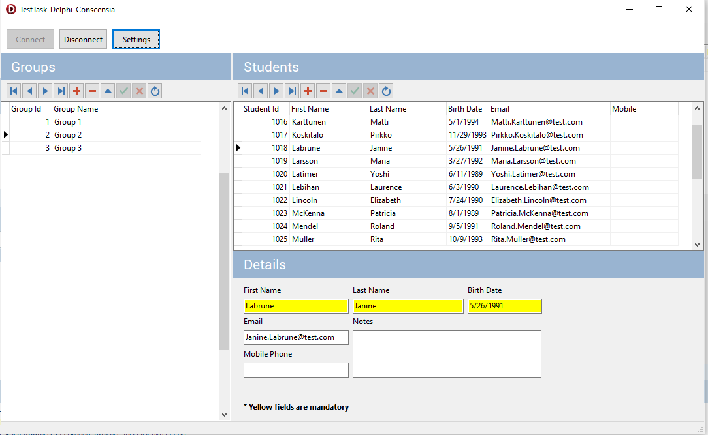

 **Task:** The project should allow feeling students to students group. Create the Delphi project with one Form. 

Put on the form two grids (TDBGrid). First grid should contain list of groups, second - list of students in selected group.
 
The following components have to be used: TDBGrid, TClientDataSet and components of db library ADO.

The data has to be stored in any database (SQL Server or others)

  **Expected Result:** Delphi project with possibility to compile and the database's structure.
##

 {align=center}

