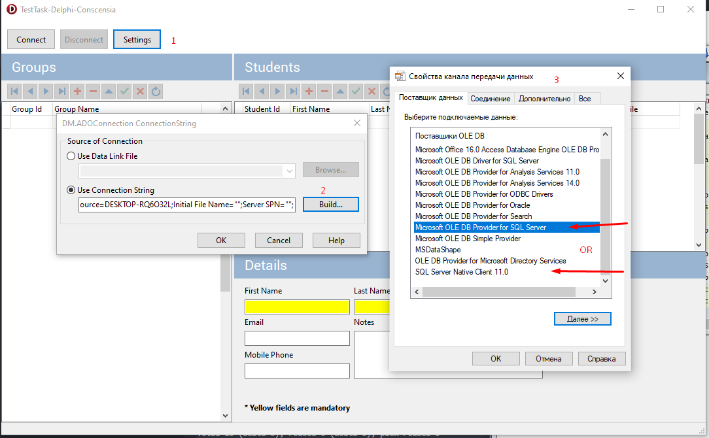
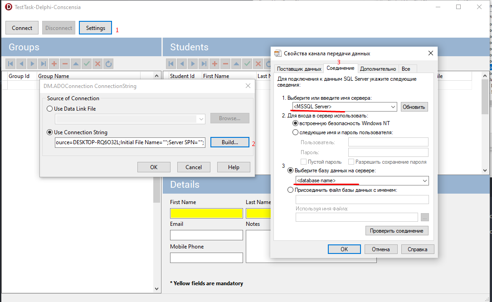

 **Task:** The project should allow feeling students to students group. Create the Delphi project with one Form. 

Put on the form two grids (TDBGrid). First grid should contain list of groups, second - list of students in selected group.
 
The following components have to be used: TDBGrid, TClientDataSet and components of db library ADO.

The data has to be stored in any database (SQL Server or others)

  **Expected Result:** Delphi project with possibility to compile and the database's structure.
##

1. Database: MSSQL Server
2. IDE: Embarcadero® Delphi 11
3. In MSSQL Manager Studio restore database from backup file test.bak or run script database-script.sql
4. Run application and set up a connection to the database ("Settings" button), the connection string will be automatically saved in the settings.ini

1. Click "Connect" button
   
